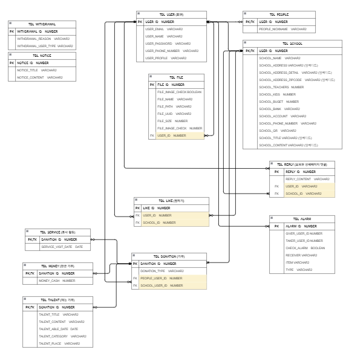

# 마일스톤(보육원 기부 활성화) 팀프로젝트입니다.

  
## 주제 선정이유 
저는 기부단체에 대해 안좋은 인식이 있었습니다. 기부단체의 기부금 횡령이나 비리 등의 소식을 종종 접했기 때문입니다. 
또한 직접 기부를 할 때 보육원 인원이나 기부현황 등 보육원의 자세하고 정확한 정보를 얻기가 쉽지않았습니다. 
그래서 기부단체에 기부금을 전달하는 것이 아닌 직접 보육원에 기부를 할 수 있고, 
보육원에 대한 정보를 쉽게 얻을 수 있고, 더 나아가 기부를 편하게 할 수 있는 서비스를 제공하자는 목표를 세우게 되었습니다. 
 
 
## 기획 
지역과 보육원이름으로 검색을 진행하여 보육원에 대한 정보를 쉽게 얻을 수 있게 하였습니다.  
랭킹시스템을 이용한 선의의 경쟁을 유도하여 도전의식과 성취감으로 누구나 쉽게 기부에 접근할 수 있게 하였습니다. 
각 보육원에 최근기부받은 내역을 추가하여 기부에 투명성을 높혔습니다. 
각 보육원마다 랭킹시스템이 따로 존재하여 기부를 많이 받지 못한 보육원랭킹에 쉽게 올라갈 수 있기 때문에 자연스레 기부를 많이 받지 못한 보육원에 기부를 할 수 있게 의도 하였습니다. 
기부금전달, 방문을 통한 배달또는 자원봉사등, 재능기부와 같은 다양한 기부형태를 제공하여 기부에 대한 접근성을 높혔습니다.  
기부시 상대측회원에 기부자의 정보가 알람으로 가게하여 보육원과 개인이 서로 연락을 주고받을 수 있게 하였습니다.  
좋아요 기능을 통해 관심있는 보육원을 저장하여 쉽게 확인할 수 있게 하였습니다.  
보육원상세페이지에 댓글을 주고 받으며 보육원과 더욱 쉽게 소통할 수 있게 하였습니다.  
 
 
## 퍼블리싱 
우선 최근 트렌드에 맞고 저희 사이트에 어울리는 참고할 사이트들을 수집하여 레이아웃을 구성했습니다.  
HTML, CSS, Java Script를 사용하여 작업했습니다. 
CSS의 가상요소와 Java Script의 다양한 이벤트를 통해 화면에 디자인을 했습니다. 미디어쿼리로 반응형 페이지를 구현했습니다. 
정규식을 이용하여 회원가입과 내정보 수정등에 유효성검사를 진행했습니다. 
 
 
## 설계 
joined 전략으로 Entity를 만들고 다른 테이블과 대부분 단방향 매핑을 하였지만 필요의 경우 양방향 매핑을 했습니다.  
임베디드를 만들어 공통요소를 묶고 Enum을 사용하여 오타의 위험을 줄였습니다. 
화면에서 사용될 값들로 DTO를 구성했습니다.  
3 Tier로 나누어 사용할 폴더와 파일을 미리 만들고 사용할 설정 파일을 만들었습니다. 
 
 
## 백작업 
통합검색과 필터로 키워드 검색 및 정렬 선택할 때 마다 쿼리가 달라져야 하기 때문에 Query Dsl의 동적쿼리로 구현했습니다.  
관리자 페이지에서 조회,추가,수정,삭제를 만들어 CRUD를 구현하였습니다. 
 
## 총평 
[아쉬웠던 점] 
JSP프로젝트를 마무리할 당시 기획과 설계가 잘 이루어져야 업무가 차질없이 진행될 수 있다는 것을 깨달았습니다. 
이 점을 인지하여 이번 스프링 프로젝트는 좀 더 수월하게 진행되도록 기획하고 설계했다고 생각했으나 
이번에는 DB쪽 설계부분이 많이 아쉬웠습니다.
테이블 대부분이 상속관계였기 때문에 저장공간은 효율적으로 활용할 수 있었으나 
데이터 조회시 매번 join을 사용하고, 데이터 추가시 쿼리가 두번 실행되어 성능이 저하되거나 쿼리가 복잡해져 
기능적인 부분을 고려하지 못한 점에 대해 많이 아쉬웠습니다. 
 
[협업의 중요성]
소수의 인원으로 이루어진 저희 팀은 기획한 기능을 완벽히 구현하고자 노력했습니다. 
저같은 경우, 책임감은 있지만 때때로 백엔드 부분에서 막힐 때 팀원에게 바로 도움을 받고  
저도 다른팀원이 도움을 구할 때 도움을 줄 수 있다는 점이 좋았습니다. 
또한 다른 팀원이 담당한 업무가 많았기 때문에  
제가 담당한 부분을 빠르게 끝내고 다른팀원과 합심하여 도왔기 때문에 
주어진 시간내에 프로젝트를 여유있게 완성할 수 있었습니다.
이러한 경험을 하며 프로젝트에서는 협업만큼 중요한 것이 없다고 생각되었습니다. 
 
[느낀점]
현재 프로젝트에서 백엔드 부분을 처음으로 개발해보며 풀스택 개발자가 되고 싶다는 생각을 하였습니다. 
깔끔한 화면부터 데이터의 저장공간을 고려한 설계와 기능의 효율성을 높일 수 있는 코드를 작성하는 것 까지 모두 흥미로웠습니다. 
프로젝트를 마무리할 때마다 느껴지는 성취감을 기대하며 앞으로 진행할 프로젝트에 성실히 임할것입니다.

 
 
## ERD
 

